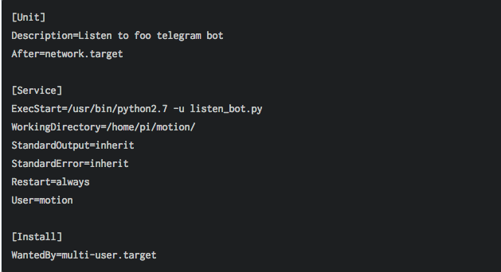
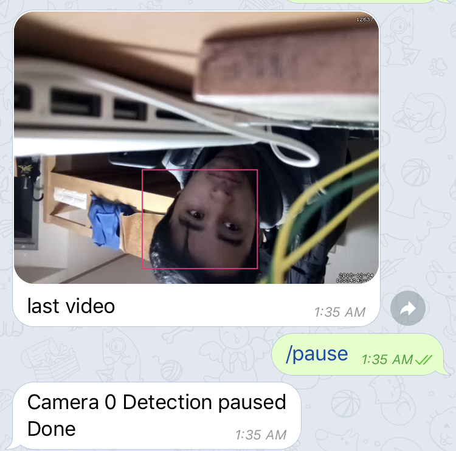
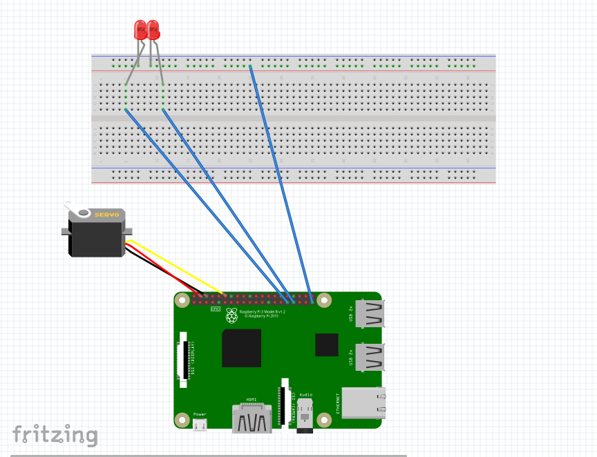
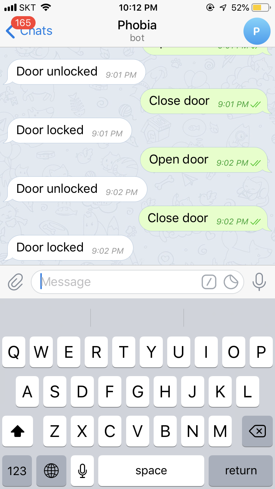
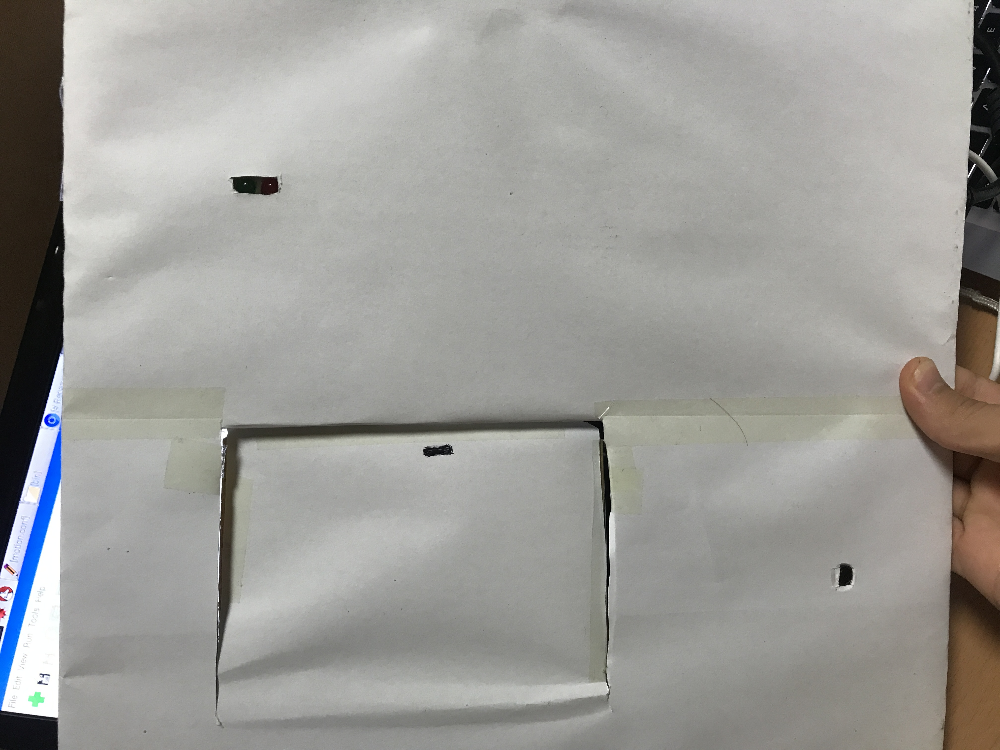
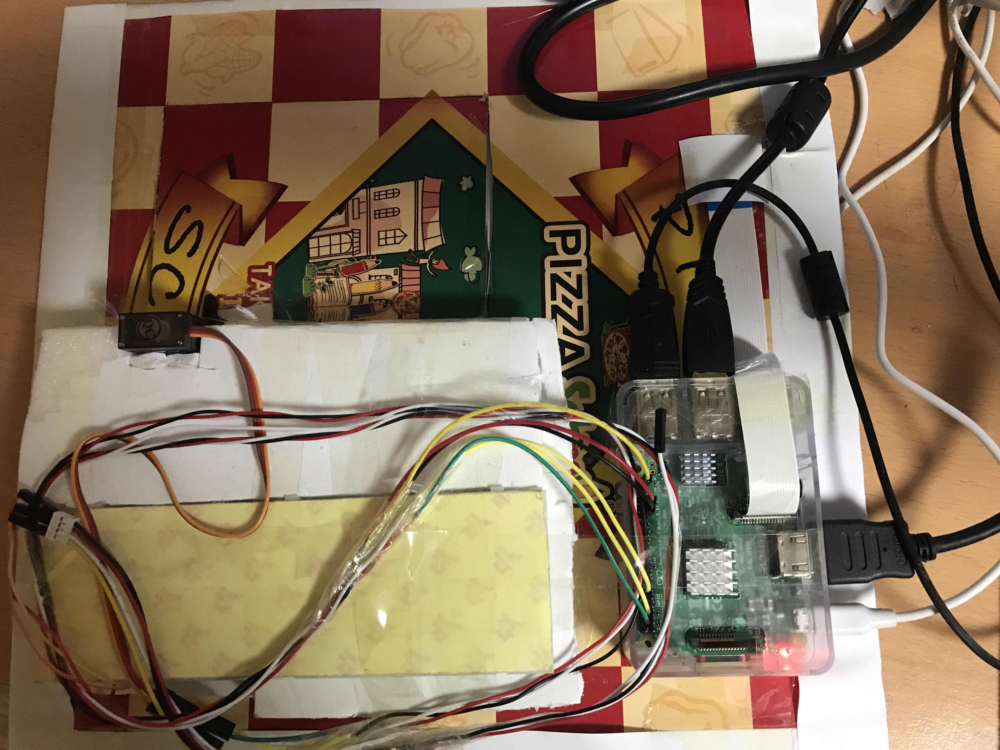

# Telegram home

## materials 
<ul>
  
<li>Raspberry pi – mini computer</li>
<li>Streaming camera or Raspberry pi camera</li>
<li>Servo motor – to control the lock</li>
<li>LED Lights – to show the lock condition (open/close)</li>
<li>Software(Language):</li>
<li>Python</li> 
<li>Telepot, Motion</li> 
</ul>

## Setting up Pi

### install Rasbian to Raspebbry pi with two options
<ul>
<li> by using monitor, keyboard and mouse. you can download noobs from <a href="https://www.raspberrypi.org/downloads/noobs/" target="_blank">raspberrypi.org </a>for free and install as usual </li>
  <a href="https://howchoo.com/g/ndy1zte2yjn/how-to-set-up-wifi-on-your-raspberry-pi-without-ethernet" target="_blank"><li> by using ssh with ip and wifi.</li></a>
</ul>

## Install Motion Software
To work with the Pi Camera you need a special version of Motion that supports MMAL cameras. The easiest way to install this is by downloading and installing a deb file as follows:
  
###### I followed the instructions provided in this great <a href="https://www.bouvet.no/bouvet-deler/utbrudd/building-a-motion-activated-security-camera-with-the-raspberry-pi-zero"> tutorial </a> by Bouvet. With some changes described below.

#### First get the deb file with the following command (if this doesn’t work then have a look for the correct release file on the Motion <a href="https://motion-project.github.io/motion_build.html">project GitHub</a>)
 
 ## Then run this commands on Terminal

##### wget https://github.com/Motion-Project/motion/releases/download/release-4.1.1/pi_stretch_motion_4.1.1-1_armhf.deb
##### sudo apt-get install gdebi-core
##### sudo gdebi pi_stretch_motion_4.1.1-1_armhf.deb

## try to run motion: type this command to terminal
##### to make copy
mkdir ~/motion && cp /etc/motion/motion.conf ~/motion/
##### run for the first time
motion -c ~/motion/motion.conf

## set up motion.connf for our project

change codes on <a href="http://ginolhac.github.io/data/motion_diff.html">motion.conf</a> // <i>i uploaded motion.conf already changed you look for this also </i>

### getting live streaming
with this configuration, you should see the live streaming from this URL: http://192.168.1.27:8081

## Communication with motion via telegram
Receiving the motion detection by emails is fine, but it can be done via Telegram and the awesome API <a href="https://telepot.readthedocs.io/en/latest/"> telepot.</a> Actually, you can even send commands to your pi using your phone using those telegram bots.

### create mybot
here is great <a href="https://www.instructables.com/id/Set-up-Telegram-Bot-on-Raspberry-Pi/"> tutorial </a> for this

### install telepot
pip install telepot

#### after installing telepot . Now if the both listen_bot.py and motion -c ~/motion/motion.conf are running, the system should work.

#### creating service 
ere, the following is working, but I am sure this is the right way to do, so use we care.
add the file listen.service in the folder /etc/systemd/system and type thsese codes.

#####run the service
##### pi@raspberrypi:/etc/systemd/system $ service listen status

### here is example of motion detected

## Setting up Servo and LED
### set up servo and LED to GPIO by following this picture

 
### Test your code 

## Finally build model of the door

